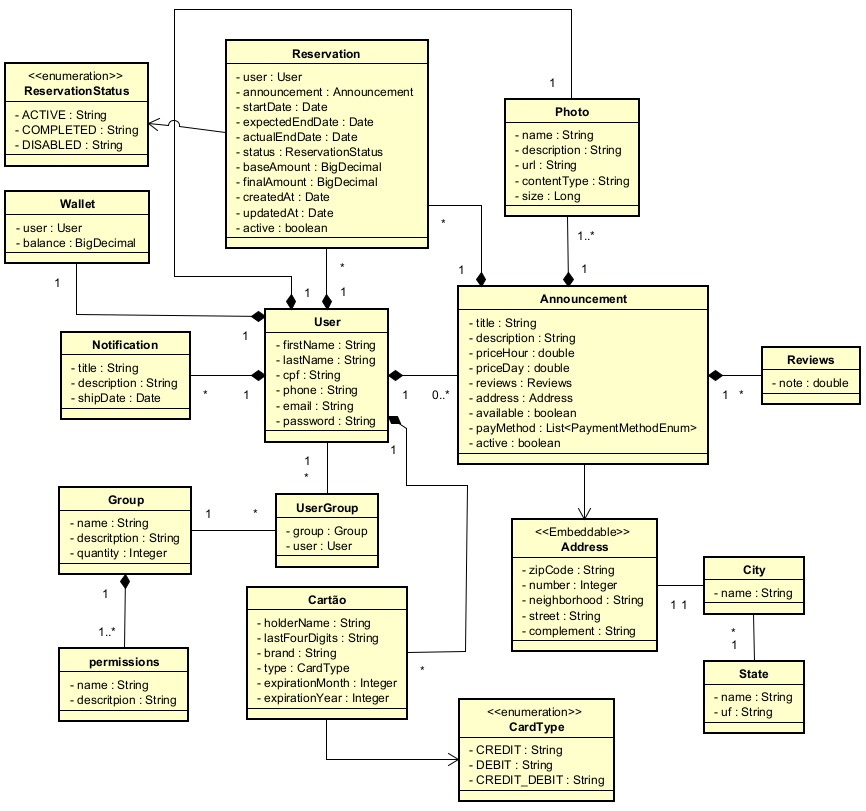

<!-- Diagrama de Classes -->


# Danki Rent API

API REST desenvolvida com **Spring Boot** para gerenciamento de um sistema de aluguel de itens, com foco inicial em **usuários**, **controle de acesso (roles e permissões)** e **gerenciamento de fotos de perfil**.

O projeto está em desenvolvimento contínuo e será expandido para cobrir regras completas de aluguel, itens, disponibilidade e contratos.

---

## 🚀 Funcionalidades Atuais

- Gerenciamento de usuários (cadastro, autenticação e atualização)
- Autenticação e autorização com JWT
- Controle de acesso baseado em grupos e permissões (RBAC)
- Upload e remoção de fotos associadas ao perfil do usuário
- Armazenamento local de arquivos
- Versionamento de banco de dados com Flyway
- Configuração de CORS e validação de senhas

---

## 🛠️ Tecnologias Utilizadas

- Java 19
- Spring Boot 3.3.4
- Spring Security + JWT
- Spring Data JPA
- PostgreSQL
- Flyway
- Lombok
- SpringDoc OpenAPI (Swagger)
- JaCoCo
- Maven

---

## 📋 Pré-requisitos

- Java 19 ou superior
- PostgreSQL
- Maven 3.6+

---

## ⚙️ Configuração do Projeto

### Clonar o repositório
```bash
git clone <repository-url>
cd back-end
```

### Banco de Dados
- Crie um banco PostgreSQL chamado `dankirent`
- Ajuste as credenciais no arquivo `application.properties`, se necessário

### Diretório de Upload
Crie o diretório:
```
C:\my-projects\fullstack\upload\
```

Ou altere o caminho no `application.properties`.

### Executar a aplicação
```bash
./mvnw spring-boot:run
```

---

## 🔧 Configurações Principais

Exemplo de `application.properties`:

```properties
# Banco de dados
spring.datasource.url=jdbc:postgresql://localhost:5432/dankirent
spring.datasource.username=postgres
spring.datasource.password=root

# Upload de arquivos
upload.path=C:\\my-projects\\fullstack\\upload\\

# JWT
api.security.token.secret=<sua-chave-secreta>
```

---

## 🔐 Endpoints Disponíveis

### Autenticação
- POST /auth/login
- POST /auth/register

### Usuários
- GET /users
- GET /users/{id}
- PUT /users/{id}
- DELETE /users/{id}
- POST /updateProfilePhoto/{userId}/profile-photo

### Grupos
- GET /groups
- POST /groups
- PUT /groups/{id}
- DELETE /groups/{id}

### Fotos
- POST /photos
- GET /photos/{id}
- DELETE /photos/{id}

---

## 📄 Documentação da API

Swagger disponível em:
```
http://localhost:8080/swagger-ui.html
```

---

## 🧪 Testes

Executar os testes:
```bash
./mvnw test
```

Gerar relatório de cobertura:
```bash
./mvnw jacoco:report
```

Relatório disponível em:
```
target/site/jacoco/index.html
```

---

## 🧱 Estrutura do Projeto

```
src/main/java/com/dankirent/api/
├── config/          # Configurações de segurança e aplicação
├── controller/      # Endpoints REST
├── exception/       # Tratamento global de exceções
├── infrastructure/  # Serviços de segurança e armazenamento
├── model/           # Entidades e DTOs
├── repository/      # Acesso a dados
└── service/         # Regras de negócio
```

---

## 🚧 Status do Projeto

🚀 **Em desenvolvimento ativo**

Este projeto está em constante evolução e novas funcionalidades serão adicionadas de forma incremental, seguindo boas práticas de arquitetura, segurança e design de domínio.

---

## 🔮 Funcionalidades Futuras

- Cadastro de itens para aluguel
- Edição e remoção de itens
- Listagem de itens disponíveis
- Bloqueio automático do item durante o aluguel
- Permitir apenas um aluguel ativo por usuário
- Criação de contrato de aluguel entre usuários
- Registro imutável das regras no contrato
- Definição de data de início e fim previsto do aluguel
- Controle de status do aluguel
- Cálculo do valor base do aluguel
- Definição de tolerância para atraso
- Cálculo automático de atraso por tempo excedido
- Geração de cobrança adicional por atraso
- Aplicação de teto máximo de cobrança
- Registro de cobranças associadas ao contrato
- Criação automática da carteira do usuário (1–1)
- Consulta de saldo da carteira
- Recarga de saldo na carteira
- Integração da recarga com API externa de pagamento
- Registro de débitos e créditos na carteira
- Atualização automática do saldo com base nas transações
- Permitir saldo negativo na carteira (configurável)
- Registro da devolução do item
- Encerramento do contrato de aluguel
- Liberação do item para novo aluguel
- Histórico de aluguéis por usuário
- Histórico de cobranças e transações da carteira

---

## 📄 Licença

Este projeto está licenciado sob a MIT License.
